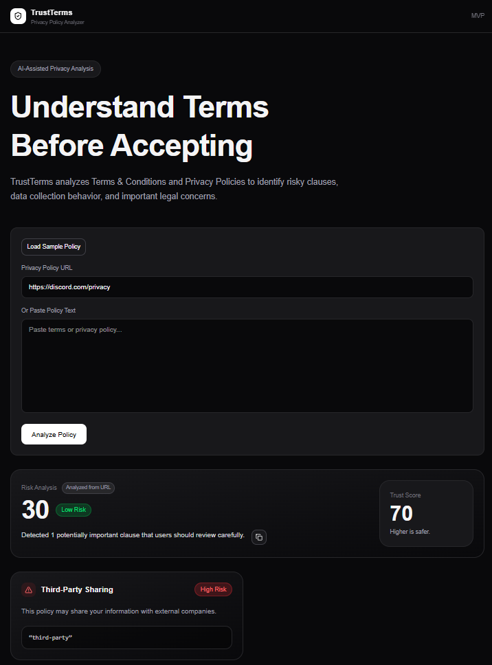

# TrustTerms

TrustTerms is a modern web application that analyzes Terms & Conditions and Privacy Policies to help users understand important risks before accepting them.

## Live Demo

https://trustterms-psi.vercel.app/

---

## Preview



---

## Features

- Analyze pasted privacy policy text
- Analyze privacy policy URLs
- Detect risky legal clauses
- Risk scoring system
- Trust score visualization
- Responsive modern UI
- Backend API architecture
- Rule-based policy analysis engine
- Safe fallback handling
- Production-ready Next.js setup

---

## Tech Stack

- Next.js (App Router)
- TypeScript
- Tailwind CSS
- Next.js API Routes
- Cheerio
- Axios
- Lucide React
- Vercel Deployment

---

## Architecture

Frontend:
- React components
- Client-side state handling
- Responsive UI

Backend:
- API routes inside Next.js
- Rule-based analysis engine
- URL scraping pipeline
- Risk scoring system
- Safe error handling

---

## Risk Detection Categories

TrustTerms currently detects:

- Third-party data sharing
- Binding arbitration
- Targeted advertising
- Location tracking
- Data retention
- Data selling
- Biometric collection
- Account termination
- Auto-renewal clauses
- Liability waivers
- Children's data references

---

## Local Setup

Clone repository:

```bash
git clone https://github.com/MohammadZayaan/trustterms.git
```

Install dependencies:

```bash
npm install
```

Run development server:

```bash
npm run dev
# or
yarn dev
# or
pnpm dev
# or
bun dev
```

Open [http://localhost:3000](http://localhost:3000) with your browser to see the result.

You can start editing the page by modifying `app/page.tsx`. The page auto-updates as you edit the file.

This project uses [`next/font`](https://nextjs.org/docs/app/building-your-application/optimizing/fonts) to automatically optimize and load [Geist](https://vercel.com/font), a new font family for Vercel.

## Learn More

To learn more about Next.js, take a look at the following resources:

- [Next.js Documentation](https://nextjs.org/docs) - learn about Next.js features and API.
- [Learn Next.js](https://nextjs.org/learn) - an interactive Next.js tutorial.

You can check out [the Next.js GitHub repository](https://github.com/vercel/next.js) - your feedback and contributions are welcome!

## Deploy on Vercel

The easiest way to deploy your Next.js app is to use the [Vercel Platform](https://vercel.com/new?utm_medium=default-template&filter=next.js&utm_source=create-next-app&utm_campaign=create-next-app-readme) from the creators of Next.js.

Check out our [Next.js deployment documentation](https://nextjs.org/docs/app/building-your-application/deploying) for more details.
